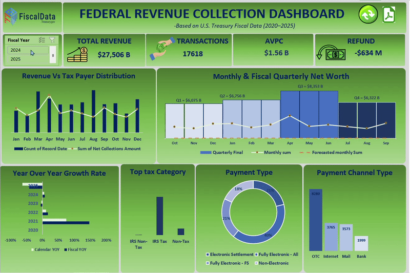

# 🏛️ U.S. Federal Tax Collection Dashboard (Excel BI | 2020–2025)

An advanced Excel-based Business Intelligence solution to analyze and visualize U.S. federal tax collection trends between 2020 and 2025. Built using Power Query, PivotTables, and VBA automation, this dashboard delivers dynamic KPIs, trend analysis, forecasting, and anomaly detection — all within a user-friendly, interactive Excel interface.

---

## 📽️ Live Dashboard Preview

---

## 📊 Key Features

- **Automated ETL Workflow**  
  Data extraction, cleaning, and transformation using **Power Query** and **structured data modeling**

- **Dynamic KPIs**  
  - Total Revenue  
  - Total Transactions  
  - Average Value Per Transaction (AVPT)  
  - Refund Amounts  
  Responsive to slicer inputs and year selections

- **Advanced Visualizations**  
  - Fiscal vs. Calendar Year YoY comparisons  
  - ETS-based revenue forecasting  
  - Seasonality-adjusted trendlines  
  - Combo, donut, and column charts  
  - Funnel and anomaly insight plots

- **Forecasting & Anomaly Detection**  
  Applied **FORECAST.ETS** and statistical thresholds to identify unusual revenue patterns and high-value/low-frequency anomalies

- **Interactive UX Enhancements**  
  - Custom slicer styles  
  - **VBA-integrated refresh and reset controls**  
  - Seamless data-driven storytelling  
  - Print-optimized export-to-PDF layout

---

## 🧠 Analytical Insights Enabled

- Revenue distribution by channel and category
- Year-over-Year revenue trend comparisons
- High-value vs high-frequency taxpayer patterns
- Seasonal forecasting based on historical patterns
- Transaction-to-revenue ratio outlier detection

---

## 🛠️ Tech Stack

| Component     | Description                              |
|---------------|------------------------------------------|
| Excel         | Core dashboard + analytics environment   |
| Power Query   | Data ingestion, cleaning, transformation |
| PivotTables   | Aggregation, filtering, and calculations |
| VBA Macros    | Automation (refresh/reset/export)        |
| Excel Charts  | Data visualization (combo, donut, line)  |

---

## 🚀 How to Use

1. Download or clone this repository
2. Open `US_Tax_Collection_Dashboard.xlsx`
3. Click **Refresh** to load dynamic KPIs
4. Use **Fiscal Year** slicers to filter the data
5. Export to PDF for a ready-to-present snapshot

---
